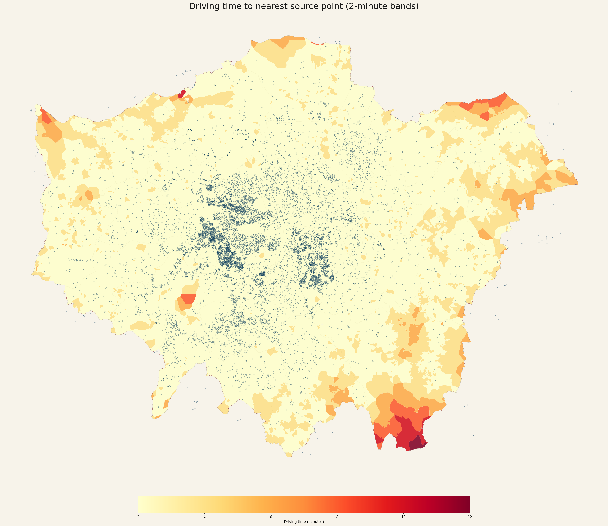

# Isochrone Analysis

This repository contains a generic tool for producing driving-time
isochrones from a set of input point locations and a boundary polygon.



## Overview

The script `isochrone_analysis.py` can be used with any GeoJSON point
set (not limited to charge points) and a boundary defined by a file or from
a place name.  It downloads or reuses a cached OSM road network, computes
travel-time isochrones around the points, and outputs both a GeoJSON of the
bands and a PNG map.

### Features

- Configurable grid resolution, time interval and buffer size
- Supports any projected CRS (default EPSG:27700)
- Optional caching of the drive network graph
- Boundary may be read from a file, geocoded from a place name, or derived
  from the point extent
- Handles disconnected nodes and missing travel times gracefully
- Outputs:
  - GeoJSON file of isochrone polygons (`--output-geojson`)
  - Map image of boundary, points and bands (`--output-map`)

## Usage

```bash
python isochrone_analysis.py \
    --points POINT_FILE.geojson \
    [--boundary BOUNDARY_FILE] \
    [--place "Place Name"] \
    [--cache GRAPH_CACHE.pkl] \
    [--crs EPSG_CODE] \
    [--buffer METERS] \
    [--grid-size METERS] \
    [--interval MINUTES] \
    [--output-geojson isochrones.geojson] \
    [--output-map iso_map.png]
```

- Specify either `--boundary` or `--place`; if neither is provided the
  boundary is computed from the point geometry extent.
- `--cache` stores/reuses the downloaded network graph, speeding subsequent
  runs.
- Defaults are provided for CRS (27700), buffer (5000 m), grid size (25 m)
  and interval (2 minutes).

## Example

```
python isochrone_analysis.py \
    --points london_chargepoints.geojson \
    --boundary London_Boroughs.gpkg \
    --cache london_drive_graph_generic.pkl \
    --output-geojson london_isochrones.geojson \
    --output-map london_iso_map.png
```

## Dependencies

- Python 3.8+
- geopandas
- osmnx
- networkx
- numpy
- pandas
- rasterio
- shapely
- matplotlib

A `requirements.txt` file listing the Python packages is included in the
root of the repository.

### Installation

```bash
python -m venv .venv            # create a virtual environment (optional)
source .venv/bin/activate        # activate on Linux/macOS
# Windows PowerShell: .\.venv\Scripts\Activate.ps1

pip install --upgrade pip
pip install -r requirements.txt
```

This will pull in all required packages.  Alternatively, if you already have a
Geopandas-enabled environment (e.g. via conda) you can skip straight to
`pip install -r requirements.txt` or adapt to your environment manager of
choice.
## Notes

The script is intended as a starting point for customised isochrone
analyses; you can extend filtering logic or alter output styling as needed.

---

I have been experimenting with a client-side, no API implementation of walking distance analysis as well. You can find them here: http://danylaksono.is-a.dev/apps/walk